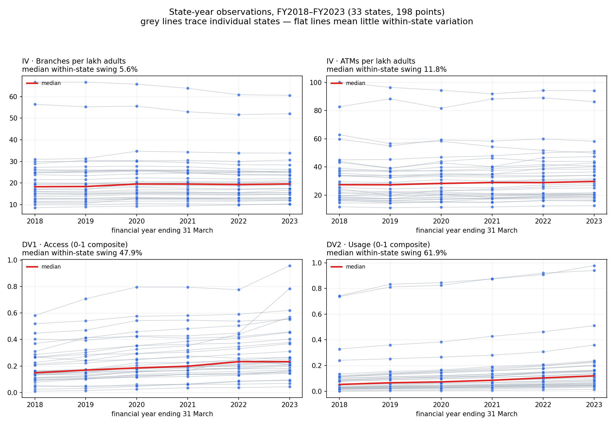
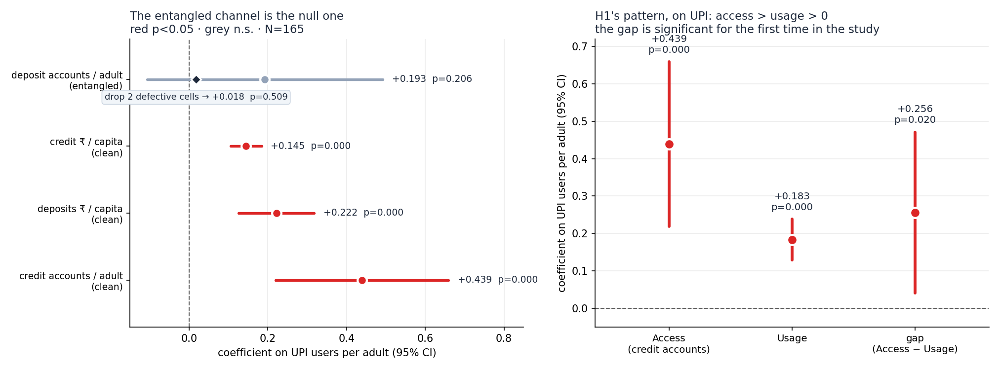

# Final Findings

**Digital Financial Infrastructure and Financial Inclusion in India** · PS 647
State panel, RBI + Census + PhonePe Pulse. Full detail in `FINDINGS.md`; decisions in `DECISIONS.md`.

---

## Bottom line

- **H1 is not supported for physical infrastructure.** Branches and ATMs do not raise Access more than Usage — and the six-year panel could not have detected it if they did.
- **It *is* supported for digital.** UPI adoption raises Access (+0.439) more than Usage (+0.183), and the gap is significant (p=0.020) — the first time in this study the access–usage gap is distinguishable from zero.
- **The effect runs through credit, not deposits.** UPI moves loan accounts; it does nothing to deposit-account counts. That asymmetry is the finding.

---

## What we built

- **9 sources** — 8 RBI/Census series plus PhonePe Pulse — merged into verified state-year panels. All-India totals reconcile to published figures to **0.00%**.
- **Three tracks:** 33 states × 6 years (N=198, branches + ATMs); 32 states × 12 years (N=384, branches only); 33 states × 5 years (N=165, branches + ATMs + UPI).
- Hypothesis rule **pre-committed before any coefficient was seen** (D10), and never revised. Every specification was logged *before* it was run.

---

## Why the physical tracks could not answer the question

- **Top row (what we use to explain):** state lines run flat. Branches move a median of **5.6%** over six years.
- **Bottom row (what we're explaining):** the same states climb steadily — Access swings **47.9%**.
- Fixed effects use only within-state movement, and **93% of infrastructure variation is *between* states** — exactly what the model discards.
- The project plan said to test this first and stop if it failed. It failed.

## Track 1 — 6 years, branches + ATMs (N=198)

- Nothing significant on Access. One significant coefficient anywhere: branches → Usage, **negative** (−0.0126, p=0.001).
- **Fragile.** Dropping 2 cells of 198 flipped the sign of every ATM coefficient. Nothing about ATMs can be concluded.
- Hausman rejects random effects (p<0.0001) — "drop state fixed effects for precision" is ruled out by the data.

## Track 2 — 12 years, branches only (N=384)

- Doubling the window doubled usable variation (7.0% → 15.3%) and **removed the fragility** — no sign flips.
- Same verdict: Access −0.0048 (p=0.455), Usage −0.0103 (p=0.071). The H1 ordering holds but both are negative, so "> 0" fails.
- Caught a real data error: **Telangana had zero branches for 2012–2014** (it split from Andhra Pradesh in 2014). Unmerged, three state-years would have entered with zero infrastructure and manufactured a spurious positive result.

---

## Track 3 — the digital track (N=165, FY2019–FY2023)

**Why we added it:** over exactly this window, physical banking infrastructure was flat while India's payments moved to phones. If financial infrastructure was doing anything, it was not doing it through branches.

- **The variation problem vanishes.** Within-state variation: branches **6.5%**, ATMs 8.2%, UPI users per adult **67.1%**. The reason Tracks 1 and 2 couldn't identify an effect does not apply here.
- **Explanatory power jumps.** Within-R² goes 0.069 → **0.609** (Access) and 0.042 → **0.863** (Usage). Fixed effects plus branches and ATMs explained nothing; one digital variable explains most of it.

### The test that mattered

PhonePe registration requires a KYC-linked bank account — so UPI adoption and *deposit-account counts* are entangled by accounting, not by economics. This is the same trap that dropping PMJDY was meant to avoid. We split the outcome into its four components to find out. The rule for reading the result was fixed before running it (D17).

- **The entangled channel is the null one.** UPI → deposit accounts: +0.193, **p=0.206** — and dropping the two cells we had already flagged as defective in RBI's own data collapses it to **+0.018 (p=0.509)**, with the standard error falling from 0.151 to 0.027.
- **The clean channel carries everything.** UPI → credit accounts: **+0.439, p=0.0001**, and completely unmoved by the same trim (+0.445).
- So the concern was not just unfounded — it pointed the wrong way. The entangled component was *diluting* a real credit effect, not manufacturing one.
- **The composite Access number is the wrong one to report** (it averages a real effect with a defect-driven artefact). Access is reported credit-only from here.

### H1 on the credit-only specification

| | Access (credit accounts) | Usage | Gap |
|---|---|---|---|
| **UPI users per adult** | **+0.439** (p<0.001) | **+0.183** (p<0.001) | **+0.256 (p=0.020)** |
| branches per lakh adults | +0.0091 (p=0.085) | −0.0062 (p=0.020) | +0.0153 (p=0.018) |
| ATMs per lakh adults | −0.0007 (p=0.773) | −0.0002 (p=0.868) | −0.0005 (p=0.884) |

- **β_access > β_usage > 0 for UPI, gap significant at 5%.** H1's predicted pattern, on the digital measure.
- **Branches turn positive on access for the first time** once Access is credit-only and digital adoption is controlled for — though only at p=0.085.
- **ATMs are null on everything.** The ATM result that looked significant before this was a composite-outcome artefact.
- Physical infrastructure still **fails** the pre-committed rule. That verdict never changed.
- **Robust to dropping any single state.** Refit 33 times: the coefficient stays between +0.356 and
  +0.477 and never loses 5% significance. Maharashtra is the most influential, but the result is
  *stronger* without it. Compare Track 1, where 2 cells of 198 flipped every ATM sign.

### A mechanism that fits

Digital payment history feeding credit underwriting — cash-flow-based lending, account aggregator — is a documented channel in India over exactly this window. It predicts precisely what we see: UPI moving loan accounts while leaving deposit accounts alone. That the data matches a mechanism is suggestive, not proof of it.

---

## What we cannot claim

- **Not** that UPI causes financial inclusion. Fixed effects remove fixed state differences and the common national trend, not state-specific time-varying confounders — smartphone penetration, fintech entry and youth share all rose alongside both UPI adoption and credit accounts.
- **Not** that H1 is confirmed. The pre-committed hypothesis was about physical infrastructure, and it failed. **UPI was added after seeing the null**, so the digital result is exploratory by construction. It should be stated as a hypothesis for a future design, not a test that was passed.
- **Nothing about ATMs**, in either direction.
- **No causal direction** for branches → Usage being negative — as consistent with branches being *placed* where deposit growth is weak as with anything causal.

## Known weaknesses

- **PhonePe is one firm** (~45–50% of UPI), and its share varies by state, so cross-state levels are noisier than within-state growth.
- Adult population is **interpolated**, not published (243 of 266 state-years) — and being near-linear, it suppresses variation in the regressors.
- **Usage is badly skewed** after 0–1 normalisation (85% of observations below 0.20), so β_access and β_usage were never on fully equivalent scales.
- Deposits and credit are recorded by **branch location, not customer residence**, inflating Maharashtra and Delhi; PhonePe uses the user's registered state — a *third* attribution rule.
- The digital panel is **5 years**, one shorter than the others; PhonePe data starts FY2019.

---

## The honest headline

> A state panel cannot identify the effect of *physical* banking infrastructure on financial inclusion,
> because branches and ATMs barely move within states. Substituting the infrastructure that actually
> moved — digital payments — the picture reverses: UPI adoption predicts access more strongly than
> usage, significantly so, and it does it entirely through credit accounts rather than deposit
> accounts. The identification problem is solved; the causal one is not.

---

**Panels:** `output/panel_analysis.csv` · `panel_long_analysis.csv` · `panel_digital.csv`
**Tables:** `output/table1`–`table13` · **Figures:** `output/fig1`–`fig3`
**Logs:** `FINDINGS.md` (F0–F14) · `DECISIONS.md` (D1–D17) · `data_fetching.md` (§1–10)
**Limitations:** `LIMITATIONS.md`

---

## Companion: H5 — Conversion Capacity

This document covers **H1** (does infrastructure raise access more than usage?). The second
hypothesis, **H5**, runs on the same `output/panel_digital.csv` and asks who H1's average is made of:
does digital financial infrastructure convert into inclusion at the same rate everywhere?

**Short answer: no, and the difference is qualitative.** Where digital literacy is low, UPI
adoption shows up as accounts opened; where it is high, as money moving. Income does not do this —
it raises both margins alike.

**→ `../h5_conversion_capacity/final_findings.md`** · plan `../h5_conversion_capacity/EXECUTION_PLAN.md` · logs `../h5_conversion_capacity/FINDINGS.md`,
`../h5_conversion_capacity/DECISIONS.md` · tables and figures `../h5_conversion_capacity/output/`

The two hypotheses share one equation: H1 is β₂ and H5 is β₅ in `../h5_conversion_capacity/output/table17_h5_stacked.csv`.
