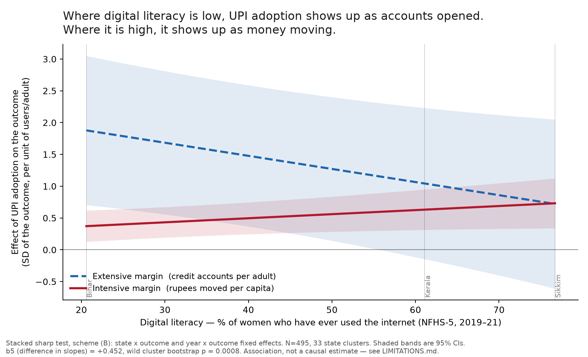
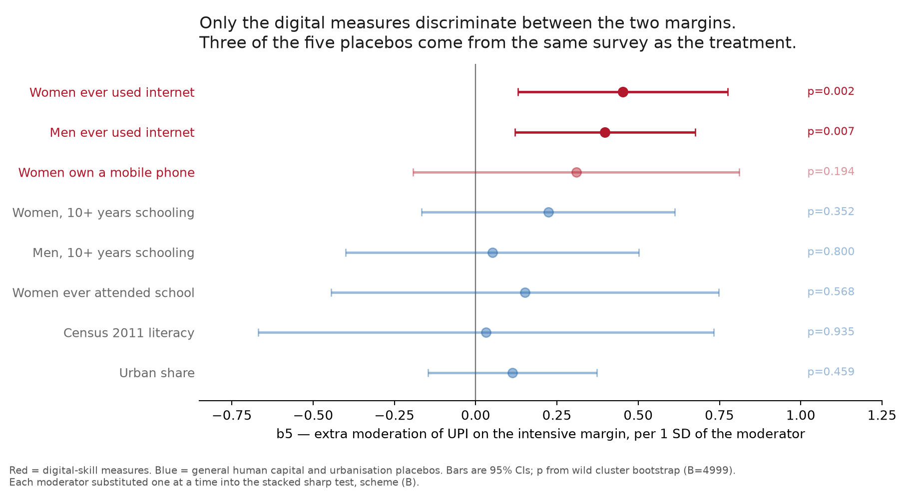

# H5 — Digital Literacy and Income as Complements

**Does digital financial infrastructure convert into financial inclusion at the same rate
everywhere?** · PS 647 · State panel, FY2019–FY2023

Companion to `../h1_access_vs_usage/final_findings.md` (H1). Same panel, same estimator, same 33
states. Detail in `FINDINGS.md` (F15–F25); decisions in `DECISIONS.md` (D18–D28); plan in
`EXECUTION_PLAN.md`; tables in `output/`.

> **Placement in the report.** This is **Hypothesis 2, Chapter 4**. It is filed under "H5" only
> because that is the number it carried in the group's original hypothesis list; the report
> numbers it 2. Report inserts for Table 2.2 and §2.7 are in `REPORT_INSERTS.md`.

---

## Bottom line

- **Infrastructure does not convert at the same rate everywhere, and the difference is
  qualitative, not a matter of degree.** Digital literacy does not make UPI adoption work
  *better*. It changes **what UPI adoption produces**.
- **Where digital literacy is low, UPI adoption shows up as accounts opened. Where it is high, it
  shows up as money held in them.** β₅ = +0.452, bootstrap p = 0.0008.
- **Income does not do this.** It moves both margins together (β₆ = +0.013, p = 0.936), under
  either income measure and under every placebo.
- **And income's apparent advantage in the simple model was an artefact of the measure.** With
  household consumption (MPCE) in place of state production (NSDP per capita), the income
  interaction that looked strongest in the chapter — p = 0.0002 — returns **p = 0.998**.
- The result survives a moderator measured in **2015-16, before UPI existed at scale**, while its
  same-vintage placebos return nothing.



---

## The question, and why it needed a different test

H1 found that UPI adoption raises credit accounts per adult by +0.439 and rupees moved by +0.183,
with the gap significant — infrastructure expanding access faster than use. H5 asks who that
average is made of.

The digital-divide literature says the answer should be *complementary endowments*: the endowments
needed to turn availability into use. Two candidates, and they are each other's main confounder —
digitally literate states are richer states. Estimated separately, either can wear the other's
costume. Both therefore enter together, and the horse race is the identification strategy.

**One reframing has to be stated up front.** The literature's "first level" is physical access to
ICTs and its "second level" is skilled use. This panel has neither. It has the **extensive margin**
(does a formal credit relationship exist — credit accounts per adult) and the **intensive margin**
(how much money moves — deposits and credit in ₹ per capita). That mapping is a judgement, not an
identity, and every claim below is about margins.

---

## What was built

| | |
|---|---|
| Panel | `output/panel_h5.csv` — 33 states × FY2019–FY2023 = **165 rows**, H1's Track 3 panel unchanged |
| Independent variable | PhonePe registered users per adult (D16), mean-centred |
| Outcomes | credit accounts/adult (extensive); deposits ₹/capita and credit ₹/capita (intensive) |
| **Skills moderator** | **NFHS-5 (2019-21): % of women who have ever used the internet** |
| **Resources moderator** | state-mean ln NSDP per capita — **and ln MPCE (HCES 2022-23)**, D25 |
| Estimator | two-way FE, SEs clustered by state, **wild cluster bootstrap on every coefficient** |

Every H1 column was asserted byte-identical on merge, and the baseline reproduces H1's Track 3
coefficients to five decimals (0.31578, 0.18330). H5 sits on top of H1; it does not restate it.

**The moderator was verified before use** against eight independently published NFHS-5 figures —
all matched exactly — and correlates **r = 0.87–0.90** with the NSS 75th round's 2017-18 computer
and internet ability measures across the 22 states where both exist. Spread: Bihar 20.6% to
Sikkim 76.7%.

---

## Descriptives and diagnostics

**Gate (pre-committed before the moderator data existed):** if digital literacy correlates above
0.85 with UPI adoption the interaction cannot be read.

| | corr with UPI adoption | within-state variation | verdict |
|---|---|---|---|
| digital literacy × UPI | **0.243** | 65.9% | PASS |
| income × UPI | 0.687 | 70.8% | PASS |
| *reference: UPI itself* | — | *67.1%* | *= H1 §3.3 exactly* |

Digital literacy is nearly orthogonal to UPI adoption. VIFs on the interactions are 2.2 and 2.6.

**Compression, carried over from H1's limitation 4 and quantified here:**

| outcome | share below 0.20 | skew |
|---|---|---|
| credit accounts / adult *(extensive)* | 46.7% | 1.10 |
| deposits ₹/capita *(intensive)* | 83.0% | 2.50 |
| credit ₹/capita *(intensive)* | 86.1% | 3.13 |

The intensive outcomes are about twice as compressed as the extensive one, so **comparing raw
coefficients across them was never like-for-like**. This is the reason the stacked test
standardises within outcome before stacking — a repair of a limitation H1 had to leave open, not a
convenience.

**Are the two moderators the same variable?** corr(literacy, ln NSDP pc) = 0.682; corr(ln NSDP pc,
ln MPCE) = 0.844. The two moderators disagree by up to **23 rank positions out of 33** (Telangana
28th on literacy and 5th on income; Manipur 15th and 30th). Without that disagreement the horse
race would be undefined. Cross-tabulated, 17 of 33 states sit off the tercile diagonal — identified,
but sparse in the corners.

---

## Result 1 — the simple interaction model, and why it misleads twice

Preferred specification, both moderators together, bootstrap p.

| outcome | UPI | × skills | × resources (NSDP) | × resources (MPCE) |
|---|---|---|---|---|
| credit accounts / adult | +0.374 (.017) | −0.061 (.104) | +0.035 (.391) | +0.019 (.625) |
| deposits ₹/capita | +0.132 (.003) | +0.056 (.061) | **+0.045 (.013)** | +0.056 (.423) |
| credit ₹/capita | +0.044 (.186) | −0.029 (.044) | **+0.053 (.0002)** | **+0.000 (.998)** |

Read on the NSDP column alone this says **resources moderate, skills do not** — the
Cole–Sampson–Zia result. Two things undercut it.

**First, the income result is measure-dependent.** NSDP per capita is a *production* measure:
output books to the state where the firm is registered, the same attribution artefact H1's §4
documents for deposits recorded at branch location. MPCE is household *consumption*. For a
moderator standing in for household resources, MPCE is the right construct. **The strongest income
coefficient in the chapter, p = 0.0002, becomes p = 0.998 under it.** D25 fixed before the result
was seen that MPCE would be the more credible if they disagreed; they disagree, and the rule is
applied.

**Second, the skills result fails its own placebo where it looks best.** On deposits ₹/capita,
substituting urban share for digital literacy gives a *larger* interaction (+0.065 vs +0.056), so
under the pre-committed R1 override H5a is not separately identified there.

**But this model asks the wrong question.** It asks whether the effect gets *bigger*. The framework
predicts capacity determines *which margin* infrastructure shows up on. That needs the outcomes in
one equation.

---

## Result 2 — the sharp test: only digital skill changes the kind of effect

Three outcomes stacked, each standardised within itself, 495 rows, 33 clusters, every outcome
carrying its own state level and its own national time path:

```
Y_itk = β₁·UPI + β₂·(UPI × Intensive_k)
      + β₃·(UPI × DigLit_s) + β₅·(UPI × DigLit_s × Intensive_k)
      + β₄·(UPI × Income_s) + β₆·(UPI × Income_s × Intensive_k)
      + γ′X_it + μ_{i,k} + λ_{t,k} + ε_itk
```

| | coefficient | p (bootstrap) |
|---|---|---|
| β₂ UPI × Intensive — *this is H1's test* | −0.906 | .081 |
| β₃ UPI × skills | −0.345 | .0077 |
| **β₅ UPI × skills × Intensive** — **H5's test** | **+0.452** | **.0008** |
| β₄ UPI × resources | +0.196 | .223 |
| β₆ UPI × resources × Intensive | +0.013 | **.936** |

- **β₅ = +0.452.** Digital literacy shifts UPI's effect away from the extensive margin and toward
  the intensive one. In the least literate states a unit of UPI adoption is worth ~1.9 SD on
  accounts and ~0.4 SD on rupees; in the most literate, ~0.7 SD on both.
- **β₆ = +0.013, p = 0.936** — and null for MPCE (+0.039, p = .805) and for every placebo tried in
  the resources slot, including women's own bank account in 2015-16, i.e. baseline financial
  inclusion (+0.247, p = .543). **Income's failure to discriminate between margins is a property of
  the channel, not of the NSDP proxy.**
- β₂ reproduces H1's finding inside the same equation. **One model, two hypotheses.**

**The fixed-effect structure is required by the data, not chosen.** The earlier draft conceded
this was a post-hoc preference. Scheme (A) — the plan's literal state + year + outcome effects — is
nested in the structure above, so the restriction is testable: **F(72, 375) = 89.21, p < 10⁻¹⁵**.
Scheme (A) is misspecified. (Classical F, not cluster-robust — with 33 clusters and 72 restrictions
no robust Wald test exists. It licenses the fixed effects, not the standard errors, which remain
bootstrapped.) Under scheme (A), β₅ = +1.055 and β₆ = +1.048 come back nearly identical and neither
is significant — the signature of fixed effects that cannot separate the two moderators.

The tercile version, which assumes no functional form, agrees: the intensive-minus-extensive gap is
**−1.06 in the bottom third of states and −0.26 in the top third** (p = .021 for the difference).

---

## Result 3 — the placebo tests, which are the reason to believe any of this



| moderator | vintage | β₅ | p |
|---|---|---|---|
| **women ever used the internet** *(treatment)* | 2019-21 | **+0.452** | **.0008** |
| **men ever used the internet** *(different respondents)* | 2019-21 | **+0.398** | **.0047** |
| **women's own mobile phone** — *pre-UPI* | **2015-16** | **+0.550** | **.049** |
| women's own mobile phone | 2019-21 | +0.309 | .195 |
| women 10+ years of schooling — *same survey* | 2019-21 | +0.223 | .352 |
| men 10+ years of schooling — *same survey* | 2019-21 | +0.051 | .818 |
| women ever attended school — *same survey* | 2019-21 | +0.152 | .578 |
| women 10+ years of schooling — *same round as the pre-UPI measure* | 2015-16 | +0.248 | .321 |
| women's own bank account — *baseline inclusion* | 2015-16 | +0.326 | .440 |
| Census 2011 literacy | 2011 | +0.031 | .932 |
| urban share | derived | +0.113 | .456 |

Three things this table does.

**It rules out a generic development gradient.** Three placebos come from the same NFHS-5
questionnaire, the same households and the same fieldwork year as the treatment. No difference in
sampling, timing, instrument or measurement error can explain why internet use produces β₅ and
years of schooling does not.

**It rules out reverse causality far better than the first pass did.** Women's mobile-phone
ownership in **2015-16** — measured three and a half years before the panel begins and before UPI's
April 2016 launch — produces β₅ = +0.550 (p = .049), while its two same-round placebos return
nothing. A moderator measured before the treatment existed cannot have been caused by the outcome.

**It rules out baseline financial inclusion**, the sharpest confound available because it concerns
the outcome rather than development: states that were already more banked in 2015-16 do not convert
UPI differently (β₅ = +0.326, p = .440).

One result in the simple model points the same way. On credit ₹/capita the digital-literacy
interaction is **negative** (−0.029, p = .044) while the two same-instrument schooling placebos are
**positive and significant** (+0.018, +0.022). Opposite signs, same survey, same respondents.

---

## Result 4 — which outcome pair carries β₅, and what the R9 failure was

The stacked test averages two intensive outcomes against one extensive outcome. One pair at a time
(330 rows each):

| extensive vs intensive | β₅ | p |
|---|---|---|
| **credit accounts vs deposits ₹/capita** | **+0.749** | **.0019** |
| credit accounts vs credit ₹/capita | +0.155 | .324 |
| deposit accounts vs deposits ₹/capita *(entangled)* | −0.296 | .446 |
| deposit accounts vs credit ₹/capita *(entangled)* | −0.890 | .089 |

**β₅ is carried entirely by the deposits pair**, and that pair clears its own placebo battery
(men's internet +0.690, p = .005; every education and urbanisation placebo null, largest +0.353 at
p = .300). The interpretive claim narrows accordingly:

> Digital literacy shifts UPI's effect away from credit-account creation and toward **deposit
> balances specifically** — not toward the intensive margin in general.

**The headline is not swapped for the larger number (D27).** +0.452 is what the plan specified
before any data existed and it is significant as specified. Promoting +0.749 after finding it by
decomposition is the retro-fitting H1's §3.6.2 exists to prevent. The pooled figure stays; the
decomposition narrows what it means.

**This also identifies the R9 robustness failure.** With the entangled deposit-accounts indicator
on the extensive side, β₅ does not merely weaken — it turns negative and **β₆ becomes significant**
(+0.420, p = .014; +0.576, p = .040). Substituting the entangled indicator replaces a skills result
with an income result, which is the signature of an accounting relationship: PhonePe registration
requires a bank account, richer states register more, account counts follow mechanically. **D17's
credit-only rule was doing real work**, and this is the clearest evidence for it in the project.

**A null that narrows the mechanism.** Does digital literacy steepen the conversion of PhonePe
*registrations* into PhonePe *transactions*? No — β₃ = −0.020 (p = .89) on counts, −0.409 (p = .089)
on value, all placebos null. Skills do not make people transact more per registration; they change
how payment adoption maps onto the **banking** system.

---

## Result 5 — the resources channel, tested to the same standard

H5b was in every specification from the start but had one measure where skills had five, no placebo
battery and no threshold specification. All three now run (F24).

- **Alternative measure:** the NSDP result does not survive MPCE (Result 1).
- **Placebo battery on the resources slot:** β₆ null for NSDP, MPCE, baseline inclusion, schooling,
  Census literacy and urban share alike.
- **Terciles:** the credit-₹ income effect is a *threshold* — absent in the poorest third
  (+0.032, n.s.), present and similar in the upper two (+0.101, +0.115) — the shape Cole–Sampson–Zia
  predicts for a price constraint. Reported with the MPCE caveat attached.

**The net position on H5b: weaker than the first pass claimed.** Its plain-model support rests on
the income measure with the known attribution artefact, and it fails the sharp test under every
measure.

---

## Robustness

| check | β₅ | p |
|---|---|---|
| baseline | +0.452 | .0008 |
| residualise digital literacy on UPI adoption | +0.358 | .0043 |
| drop the two known RBI data defects (§2.7) | +0.427 | .0029 |
| drop the four small UTs | +0.462 | .045 |
| drop the three highest and three lowest literacy states | +0.602 | .013 |
| **add deposit accounts to the extensive side** | **−0.070** | **.691** |

**Leave-one-state-out: 33 refits, range +0.382 to +0.560, worst p = 0.029, zero sign flips, zero
refits losing significance.** Contrast H1's Track 1, where two cells of 198 flipped every ATM sign.

The last row is a genuine failure, diagnosed in Result 4 rather than explained away.

---

## What this means

**Uniform infrastructure does not produce uniform inclusion, and the non-uniformity is qualitative.**
The same UPI rollout reaching two states equally leaves one with more bank accounts and the other
with more money held in them. Counting accounts — the standard inclusion metric, and the one PMJDY
is scored on — records the low-capacity state as the bigger success when what it gained is the
thinner outcome. **This is the access–usage gap of Chapter 1 reappearing inside the digital result,
distributed by skill.**

**It also speaks to the mechanism H1 proposed.** H1 §3.5.5 suggests UPI moves credit accounts
through payment history feeding cash-flow underwriting. H5 finds digital literacy does **not**
moderate that channel — the credit-₹ pair is null, the skills interaction on credit accounts is
negative. That is consistent with the proposed mechanism rather than against it: if underwriting
reads the borrower's payment trail algorithmically, the borrower's own skill is not the binding
input. **Skill matters where the user must act — accumulating a balance — not where an algorithm
acts on their behalf.**

**Joint reading with H1:** digitalisation expanded formal access broadly, but whether that access
became functional depended on a skill endowment already unequally distributed. Income buys more of
the same thing; digital skill changes what you get.

**For policy**, the sequencing claim is narrower than the plan anticipated but sharper. Digital
skilling is not what makes infrastructure spending *work* — the main effect is positive everywhere,
and low-literacy states get the largest gains in account creation. It determines whether the
accounts get *used*. That is a more defensible claim than "train people first".

**H5a and H5b as originally written.** H5a — "the effect is stronger where digital literacy is
higher" — is **not supported**: the effect is not stronger, it is differently composed. H5b — "the
effect is stronger among higher-income groups" — is **not robustly supported**: it holds on NSDP
per capita, disappears on MPCE, and fails the sharp test under both. The unified H5 corollary —
that complementary endowments conditions usage rather than access — **holds, and holds for skills
alone**.

---

## What this cannot claim

1. **No causal claim.** H5 interacts a main effect that is a within-state correlation between two
   co-trending series, added after the pre-registered physical-infrastructure hypothesis failed.
   The permitted form is: *the UPI–inclusion association differs by margin, and that difference
   varies with digital literacy.*
2. **β₅ is partially protected, not immune.** It differences outcomes measured on the same state in
   the same year, so confounders acting equally on both margins drop out. A confounder moving the
   two margins *differently* and correlated with digital literacy would still contaminate it. The
   placebo battery and the pre-UPI moderator are evidence against that, not proof.
3. **β₅ rests on one outcome pair** (Result 4) — a claim about deposit balances, not the intensive
   margin in general.
4. **State-level, not person-level.** A district design was checked and is impossible: NFHS-5
   publishes internet use only in the state fact sheets (D19).
5. **33 clusters**, with moderators that are one number per state — the hardest case for
   cluster-robust inference, which is why every p-value here is a wild cluster bootstrap.
6. **PhonePe is one firm**, ~half of UPI, with state-varying market share. If that share is higher
   in more digitally literate states, part of β₅ is measurement.
7. **The moderator is self-reported ever-use**, not tested skill — a coarse proxy that likely
   attenuates toward zero, making the estimate conservative.

---

## Reproducing this

```
python scripts/build_moderators.py        # -> ../data/09_diglit.csv
python scripts/build_h5_panel.py          # -> output/panel_h5.csv
python scripts/h5_descriptives.py         # -> table21   (before any estimate)
python scripts/h5_gates.py                # -> table14   (the go/no-go)
python scripts/estimate_h5.py             # -> table15, 15b, 15c
python scripts/h5_placebo.py              # -> table16   (outranks table15)
python scripts/estimate_h5_stacked.py     # -> table17   (the headline)
python scripts/estimate_h5_threshold.py   # -> table18
python scripts/h5_robustness.py           # -> table19, 19b
python scripts/h5_supplementary.py        # -> table20   (Result 4)
python scripts/h5_income.py               # -> table22   (Result 5)
python scripts/h5_spec_tests.py           # -> table23   (FE test, pre-UPI moderator, Hausman)
python scripts/plot_h5.py                 # -> fig4, fig5
```

Needs `../h1_access_vs_usage/output/panel_digital.csv` first. Requires `pandas`, `numpy`, `scipy`,
`linearmodels`, `matplotlib`.
